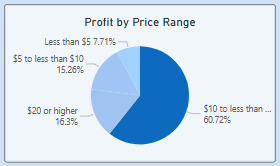

# 1. Introduction

## 1.1. Context
Maven Toys is a fictitious chain of toy stores in Mexico, with the first store launched in 1992. By 2016, Maven Toys has expanded to total of 50 stores located in all regions over the country.

The Maven Toys Executive team and Sales team are planning for sales and marketing strategies for the upcoming year. They want to know which stores and products to focus on. This project aims to provide stakeholders with significant insights from sales performance data and give them recommendations to take informative decisions.

## 1.2. Dataset
The dataset is provided by [Maven Analytics](https://mavenanalytics.io/blog/maven-toys-challenge).

This project will utilize 3 out of 4 tables in the dataset:
- Products table contains the 35 products sold at Maven Toys (each record represents one product), with fields containing details about the product category, cost, and retail price.
- Stores table contains the 50 Maven Toys store locations (each record represents one store), with fields containing details about the store location, type, and date it opened.
- Sales table contains the units sold in over 800,000 sales transactions from January 2017 to September 2018 (each record represents the purchase of a specific product at a specific store on a specific date).

### Data dictionaries
#### `products.csv`
|**Field**|**Description**|
|-|-|
|Product_ID|Product ID|
|Product_Name|Product name|
|Product_Category|Product Category|
|Product_Cost|Product cost ($USD)|
|Product_Price|Product retail price ($USD)|

#### `stores.csv`
|**Field**|**Description**|
|-|-|
|Store_ID|Store ID|
|Store_Name|Store name|
|Store_City|City in Mexico where the store is located|
|Store_Location|Location in the city where the store is located|
|Store_Open_Date|Date when the store was opened|

#### `sales.csv`
|**Field**|**Description**|
|-|-|
|Sale_ID|Sale ID|
|Date|Date of the transaction|
|Store_ID|Store ID|
|Product_ID|Product ID|
|Units|Units sold|

## 1.3. Project Roadmap
### Step 1: Prepare and process
- Import csv files into Power BI Desktop
- Use Power Query to transform data before loading: check and correct data types, rename columns, remove unnecessary columns/rows, etc.
- Import Mexico geographical data from the internet, including cities, states, etc. then use Power Query to merge queries on `Store_City` field to create new columns: `Store_State`, `Store_Region`, `Store_Lat`, `Store_Long`
### Step 2: Data modeling
<!-- - Create a new dimension table that hold geography data of states and corresponding regions -->
- Create a common date table with the earliest and latest dates from the fact table (`sales`)
- Create 1-to-many relationships between dimension tables and the fact table

### Step 3: Analyze
- Aggregate data and perform calculations to dentify trends and relationships
- Divide the report into 3 pages: Overall Performance, Store Performance, Product Performance
- Metric selected: Total Sales, Profit, Profit Margin (for all pages); Total Orders (for Overall Performance and Store Performance); Total Units Sold (for Product Performance); and other metrics
- Visualize data, create metric parameters to enable stakeholders to dive deep into data and actively interact with the multi-dimensional report

# 2. Performance Report
## 2.1. Overall Performance

## 2.2. Store Performance

## 2.3. Product Performance

# 3. Insights and Recommendations
## 3.1. Overall Performance

- Total sales and profit share a quite similar trend: a slight increase in the period from Mar to May, followed by a decline in Aug to Sep, then reaching a peak in Dec (holiday seasons: Christmas, New Year).
- Whereas profit margin seems to have the reverse pattern, it reached the peak of more than 32% in Aug 2017, then steadily decreases overtime, but still remain above 25%.

## 3.2. Stores
**Region:**

- The number of stores and the total sales that each region contributes are relatively proportional to each other. For instance, the North and the Center contribute more than 60% revenue, corresponding to 30 out of 50 stores (60%). 
- On average, each store in the Center has daily sales of $551, $116 higher than the South. The company can consider prioritizing the Center region when planning for new stores expansion (other factors to consider: new store investments, predicted demand, growth potential, target market, competition, operation costs, etc.) while taking some actions to improve daily sales from other regions, especially the South.

**Location:**

- 29 out of 50 stores (nearly 60%) are located in Downtown area. On average, each store in Airport area generates by far the most daily revenue with $708, exceeds the 3 other areas. Airports seem to be a potential area to place new stores, the company need to investigate other factors.

**Top performers:**

- Apparently, the Ciudad de Mexico 2 store perform the best in total sales, total orders and profit. However, it is surpassed in profit margin, only ranks 4th. The company could consider this store and other well-performed ones to be flagship stores that provide best services.

## 3.3. Product
**Product categories:**

- From 2017 to 2018, 4 out of 5 categories (Toys, Sport & Outdoors, Games, Art & Crafts) rise in demand. Especially, Art & Crafts increase more than 3.5 times in total sales. Only Electronics category's demand decreases (27% lower than the past year).

- Toys is the company's key category that account for over 35% of total revenue, compared to 15-19% of other categories. It also contributes the highest profit (26% of total), but records the lowest margin (21%).
- In term of quantity sold, Art & Craft perform really well with nearly 30% overall and 37% in the current year (2018). Electronics category has the lowest units sold (12%).
- Despite it's lowest units sold, Electronics brings the 2nd largest profit amount (25%). The reason might be its noticeably profit margin, 45%, which is significantly higher than other categories' that are 30% or lower.

**Product:**

- Products having prices from $10 to less than $20 produce the most quantity sold, total sales and profit. Whereas, the range Less than $5 records the highest margin.

**Some recommendations:** The company should consider diversifying its product portfolio, especially in Electronics category as it brings the most profit margin. It's necessary to investigate more on pricing strategies and the relationship among prices - revenue and profit, so that we can make informative decisions on adjusting pricing frames of products to optimize the overall performance.